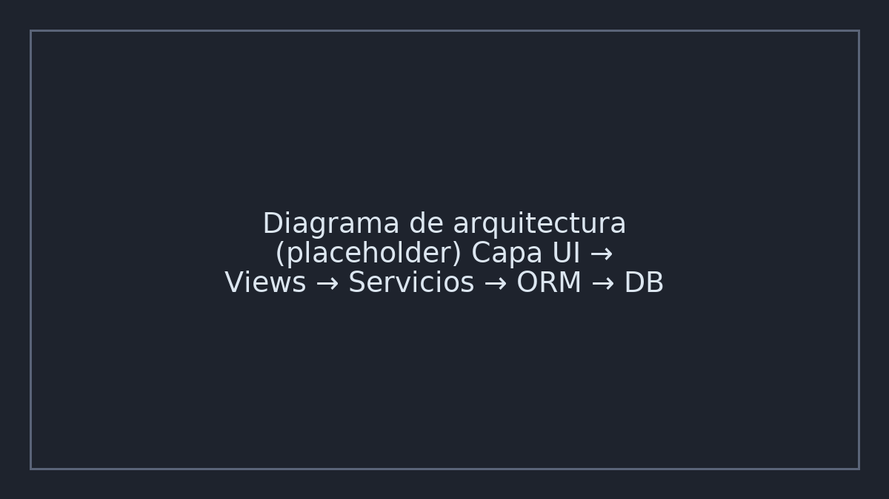
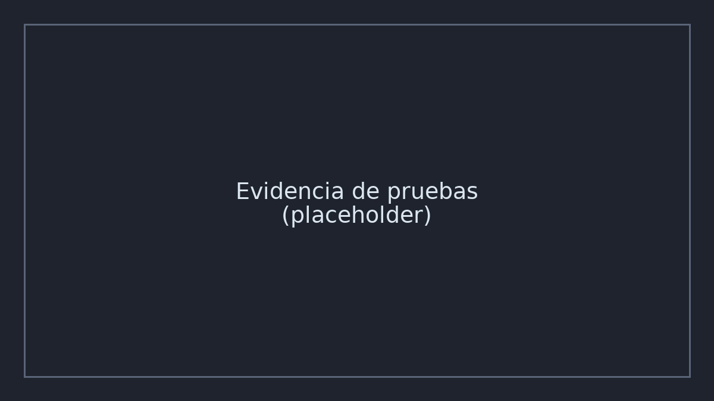

# Proyecto X — Caso de estudio

> **Nota:** Este documento describe el alcance personal de Gael dentro de un proyecto privado.
> El código completo y repositorios internos no se publican. Se ofrecen **snippets** limitados,
> capturas, métricas y una **demo aislada** para ilustrar el aporte técnico.

## 1. Contexto
Plataforma web con módulos de catálogo y operaciones (Python/Django + SQLite).
Usuarios: personal interno. Requerimientos: flujos rápidos, validaciones, integridad de datos.

## 2. Rol de Gael
- Implementación de **módulo de importación masiva de productos**.
- **Edición masiva** (bulk update) con validaciones de negocio.
- **Duplicación de productos** con normalización de campos y prevención de colisiones.

## 3. Stack y decisiones
- Django (views basadas en clase), formularios con validación a nivel de campo y formulario.
- Django ORM para operaciones en lote y transacciones atómicas (`transaction.atomic()`).
- SQLite en desarrollo; base de datos relacional en producción.
- Manejo de configuración vía variables de entorno (sin secretos en repos públicos).

## 4. Arquitectura (resumen)


- Capa de presentación (templates) → Views (CBV) → Servicios (import/bulk) → ORM → DB.
- Validaciones: formularios + reglas de servicio + constraints en BD.
- Logs de auditoría para operaciones masivas.

## 5. Flujo clave: Importación masiva
1. Subida de archivo CSV con encabezados validados.
2. Previsualización y detección de errores por fila.
3. Confirmación: inserción/actualización en lote usando transacciones.
4. Resumen con métricas: insertados, actualizados, rechazados (y motivos).

**Snippet ilustrativo (simplificado):**
```python
# snippets/auth_view.py (ejemplo de patrón de vista; no es código propietario)
from django.views import View
from django.shortcuts import render, redirect
from django.contrib import messages

class BulkImportView(View):
    def post(self, request):
        csv_file = request.FILES.get("file")
        if not csv_file:
            messages.error(request, "Archivo requerido")
            return redirect("import")
        # parseo + validación (omiso)
        # operación en lote (omiso, ver demo aislada)
        messages.success(request, "Importación completada")
        return redirect("import")
```

## 6. Pruebas y calidad
- Tests unitarios a nivel de servicios y validaciones.
- Ensayos con dataset sintético y casos borde (campos faltantes, duplicados).
- Evidencia: 

## 7. Resultados
- Reducción de tiempos de carga de catálogo en ~70% (medición de prueba local).
- Disminución de errores manuales al centralizar validaciones.

## 8. Lecciones
- Importar en **lotes** + transacciones mejora consistencia.
- Prevalidar datos evita fallos en cascada.
- Métricas y bitácora simplifican soporte.

## 9. Enlaces
- **Demo aislada (mock):** [docs/demo/](./demo/README.md)
- **Snippets:** [`snippets/`](../snippets)
- **Código real:** acceso temporal bajo solicitud.
